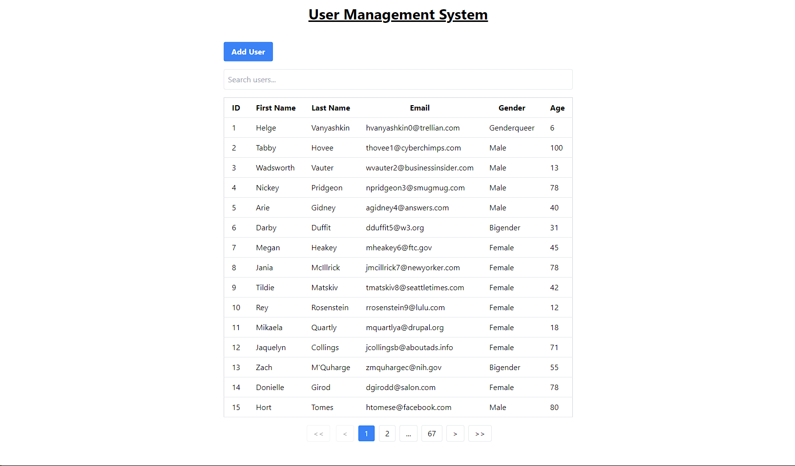

# User Management System

## Setup:

- Clone this repository
- Run `npm install` in the frontend directory
- Run `npm install` in the root directory
- Run `npm run dev` in the root directory

## Images:

### Dashboard:

### Add User:

### Sorting:

### Search:

